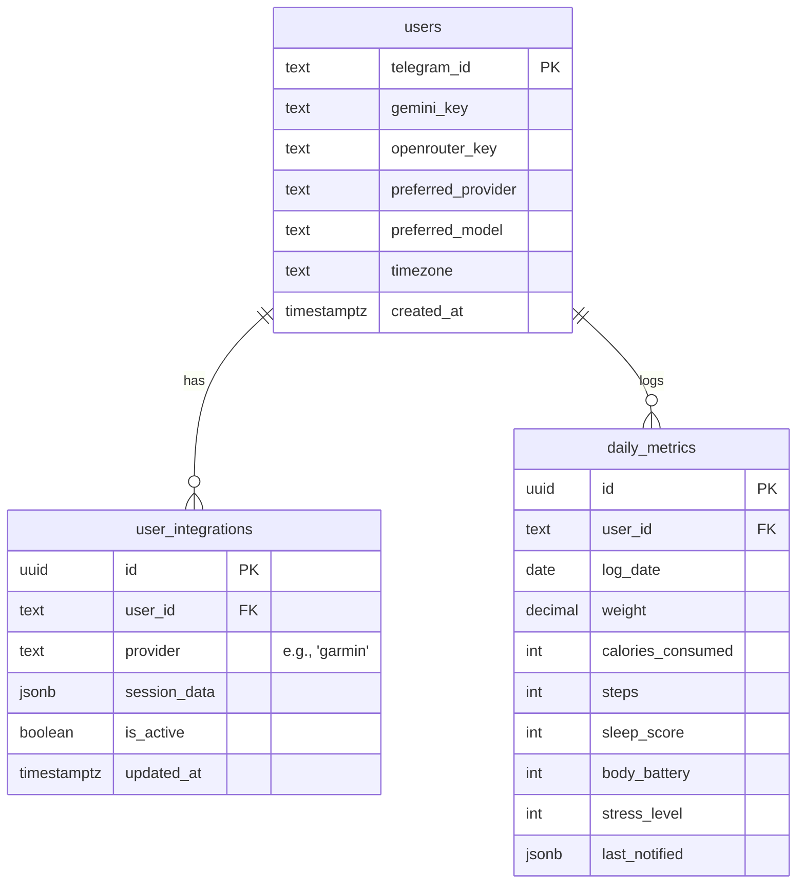

# Fitness Bot Database Schema

This document outlines the relational database structure used by the Fitness Bot to manage user profiles, platform integrations, and health metrics.

---

## Entity Relationship Diagram

---

## Tables Overview

### 1. `users`
**Purpose**: Stores the persistent identity and global settings of each person using the bot.
- **`telegram_id`**: The unique identifier from Telegram. Used as the main reference across all tables.
- **`gemini_key`**: The user's personal Google AI API key.
- **`openrouter_key`**: The user's personal OpenRouter API key.
- **`preferred_provider`**: The active provider (defaults to `gemini`).
- **`preferred_model`**: The specific model to use for that provider.
- **`timezone`**: Used to ensure reports and reminders arrive at the correct local time (defaults to `Asia/Kolkata`).

### 2. `user_integrations`
**Purpose**: Manages connections to third-party health platforms.
- **`provider`**: Identifies the source (e.g., `garmin`). This design allows a user to link multiple sources (Garmin, Google Fit, Apple Health) in the future.
- **`session_data`**: Stores the OAuth tokens or session cookies securely in JSON format.
- **`is_active`**: Allows a user to temporarily disable an integration without deleting their data.

### 3. `daily_metrics`
**Purpose**: A high-frequency table that stores health "snapshots" for every day.
- **`log_date`**: The specific date for these metrics.
- **`weight`**: Recorded manually by the user or pulled from smart scales.
- **`calories_consumed`**: Aggregate calories from manual logs and MyFitnessPal.
- **`steps`, `sleep_score`, `body_battery`, `stress_level`**: Snapshots pulled from Garmin/MFP for that specific day.
- **`last_notified`**: Tracks which scheduled reminders (morning, water, evening) have already been sent for this date to prevent duplicates.

---

## Common Use Cases

### Generating a Daily Report
To generate a report, the bot queries:
1. `users` (for the AI key and timezone).
2. `user_integrations` (to check if it needs to fetch fresh data from Garmin).
3. `daily_metrics` (to see what has already been logged vs what needs to be analyzed).

### Historical Trend Analysis
To show a weight chart, the bot simply queries `daily_metrics` filtered by `user_id` and sorted by `log_date`. This is extremely fast because it ignores the large session blobs in the integrations table.

### Platform Expansion
To add Apple Health support, we simply add a new row to `user_integrations` with `provider = 'apple_health'`. The rest of the `daily_metrics` logic remains completely unchanged.
